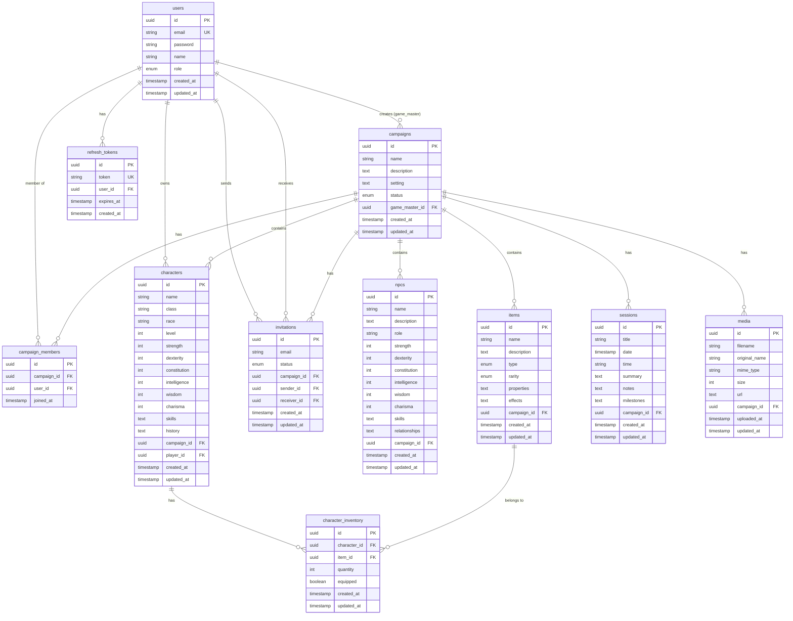

# QuestForge Database - Entity Relationship Diagram

## Visual Schema Representation



## Table Relationships Summary

### One-to-Many Relationships

1. **users → campaigns** (as game_master_id)
   - One user (Game Master) can create many campaigns
   - Each campaign has one Game Master

2. **users → characters** (as player_id)
   - One user (Player) can own many characters
   - Each character belongs to one player

3. **users → refresh_tokens**
   - One user can have many refresh tokens
   - Each refresh token belongs to one user

4. **campaigns → characters**
   - One campaign can have many characters
   - Each character belongs to one campaign

5. **campaigns → npcs**
   - One campaign can have many NPCs
   - Each NPC belongs to one campaign

6. **campaigns → items**
   - One campaign can have many items
   - Each item belongs to one campaign

7. **campaigns → sessions**
   - One campaign can have many sessions
   - Each session belongs to one campaign

8. **campaigns → media**
   - One campaign can have many media files
   - Each media file belongs to one campaign

9. **campaigns → invitations**
   - One campaign can have many invitations
   - Each invitation belongs to one campaign

10. **users → invitations** (as sender_id)
    - One user can send many invitations
    - Each invitation has one sender

11. **users → invitations** (as receiver_id, optional)
    - One user can receive many invitations
    - Each invitation may have one receiver (null until accepted)

### Many-to-Many Relationships

1. **users ↔ campaigns** (through campaign_members)
   - Many users can be members of many campaigns
   - Junction table: campaign_members

2. **characters ↔ items** (through character_inventory)
   - Many characters can have many items
   - Many items can belong to many characters
   - Junction table: character_inventory (with quantity and equipped fields)

## Cascade Delete Behavior

```
users (deleted)
├── refresh_tokens (CASCADE)
├── campaigns (CASCADE as game_master)
│   ├── campaign_members (CASCADE)
│   ├── characters (CASCADE)
│   │   └── character_inventory (CASCADE)
│   ├── npcs (CASCADE)
│   ├── items (CASCADE)
│   │   └── character_inventory (CASCADE)
│   ├── sessions (CASCADE)
│   ├── media (CASCADE)
│   └── invitations (CASCADE)
├── invitations (CASCADE as sender)
└── invitations (CASCADE as receiver)
```

## Data Flow Examples

### Creating a Campaign
1. User (Game Master) creates a campaign → `campaigns` table
2. Game Master automatically becomes a member → `campaign_members` table
3. Game Master invites players → `invitations` table
4. Players accept invitations → `invitations` status updated, `campaign_members` entries created

### Character Creation Flow
1. Player joins campaign → `campaign_members` entry
2. Player creates character → `characters` table
3. Game Master creates items → `items` table
4. Items assigned to character → `character_inventory` table

### Session Recording Flow
1. Game Master records session → `sessions` table
2. Game Master uploads maps → `media` table
3. Players view session history (read-only)

## Indexes for Performance

### Primary Indexes (Foreign Keys)
- All foreign key columns have indexes
- Enables efficient JOIN operations

### Secondary Indexes
- `users.email` - Fast user lookup during authentication
- `campaigns.status` - Filter campaigns by status
- `items.type` - Filter items by category
- `items.rarity` - Filter items by rarity
- `sessions.date` - Sort sessions chronologically
- `invitations.status` - Filter pending/accepted invitations
- `refresh_tokens.token` - Fast token validation

## Security Considerations in Schema

1. **Password Storage**: Plain password column - MUST be hashed with bcrypt
2. **Token Management**: Separate refresh_tokens table for JWT security
3. **Cascade Deletes**: Prevents orphaned records but requires careful deletion
4. **Email Uniqueness**: Prevents duplicate accounts
5. **Foreign Key Constraints**: Maintains referential integrity

## Schema Versioning

Current Version: **1.0**

For future changes:
- Use database migrations (Prisma Migrate or similar)
- Never modify existing migrations
- Always create new migrations for changes
- Test migrations on staging before production

## Notes for Developers

1. **UUIDs vs Auto-increment IDs**: Using UUIDs for better distributed system support
2. **Timestamps**: All tables have created_at/updated_at for audit trails
3. **Text Fields**: Using TEXT for long-form content (descriptions, summaries)
4. **Enums**: Using database enums for type safety
5. **Nullable Fields**: Optional fields (like NPC attributes) allow flexibility
